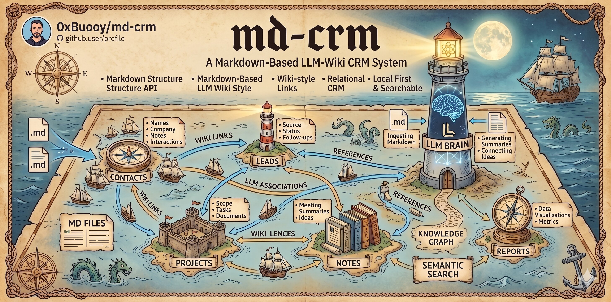

# MD CRM



A personal CRM that lives in your terminal. Drop notes about people you meet, and your AI agent compiles them into a structured, interlinked wiki.

Based on [Karpathy's LLM Wiki](https://gist.github.com/karpathy/442a6bf555914893e9891c11519de94f) pattern.

## Install

### Hermes (one-liner)

```bash
hermes skills install 0xbuooy/md-crm
```

Prompts for `wiki_path` and `raw_path` on first install and stores them in `~/.hermes/config.yaml` under `skills.config`. See the [Hermes skills docs](https://hermes-agent.nousresearch.com/docs/user-guide/features/skills) for changing them later.

### OpenClaw (one-liner)

```bash
git clone https://github.com/0xbuooy/md-crm ~/.openclaw/skills/md-crm
```

Then add paths to `~/.openclaw/openclaw.json`:

```json
{
  "skills": {
    "entries": {
      "md-crm": {
        "enabled": true,
        "config": {
          "wiki_path": "/path/to/your/wiki",
          "raw_path": "/path/to/your/notes"
        }
      }
    }
  }
}
```

OpenClaw also discovers skills from `~/.agents/skills/` and `<workspace>/skills/` if you prefer a different location.

### Claude Code / Codex / OpenCode

New directory:

```bash
git clone https://github.com/0xbuooy/md-crm ~/crm
cd ~/crm && claude     # or: codex / opencode
```

Inside an existing Obsidian vault:

```bash
cd ~/your-vault
git clone https://github.com/0xbuooy/md-crm .md-crm-skill
mkdir -p .claude/skills/md-crm
cp .md-crm-skill/SKILL.md .claude/skills/md-crm/SKILL.md
cp .md-crm-skill/AGENTS.md ./AGENTS.md
cp -r .md-crm-skill/crm ./crm
```

Then edit `crm/_config.md` to point `raw_sources` at your note directories (`daily/`, `meetings/`, etc.). Empty `wiki_path` / `raw_path` fall back to `./crm` and `.` (cwd) so `raw_sources` resolve relative to the vault root.

## Usage

Open your agent and talk naturally:

**Ingest**: "I just had coffee with Jane Doe. She's a PM at Stripe, interested in AI agents for payments. She wants an intro to Marcus."

**Query**: "Who do I know at Stripe?" / "What did Marcus and I last discuss?" / "Who should I follow up with?"

**Lint**: "lint" - surfaces decaying relationships, stale threads, and missing pages.

## Local Testing

The e2e suite runs in Docker — no host install of Hermes or OpenClaw
required, just Docker and an API key.

```bash
export ANTHROPIC_API_KEY=sk-ant-...
make docker-build        # first time
make test-docker         # both suites

# Interactive shell inside the agent image
make docker-shell-hermes
```

See `tests/e2e/README.md` for filters, fixture authoring, and the matcher
reference.

## How It Works

1. You describe interactions or point at existing notes
2. The agent compiles structured person/company wiki pages
3. Knowledge accumulates - queries hit compiled pages, not raw notes
4. Lint surfaces what needs attention

No database. No API. No dependencies. Just markdown.

## Works With

- Claude Code (`SKILL.md`)
- OpenAI Codex (`AGENTS.md`)
- OpenCode / Pi (`OPENCODE.md`)
- Any agent that reads markdown instruction files

## Obsidian

Point Obsidian at the directory containing `crm/` as a vault, or place it inside an existing vault. You get:

- Graph view of your relationship network
- Backlinks between people, companies, and notes
- Full-text search across compiled pages
- Daily notes linking naturally to CRM entries

## License

MIT
